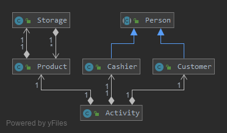
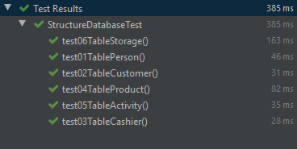
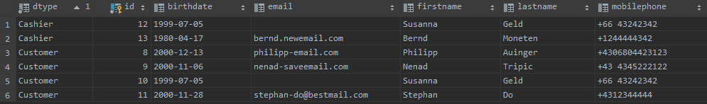

= Übung 03 - Quarkus-Panache - Philipp Auinger 5BHIF
:toc:
:toc-title: Inhaltsverzeichnis
:toclevels: 3

ifdef::env-github[]
:tip-caption: :bulb:
:note-caption: :information_source:
:important-caption: :heavy_exclamation_mark:
:caution-caption: :fire:
:warning-caption: :warning:
endif::[]

:source-highlighter: coderay

== 01. Panache
=== Vorbereitung
==== Quarkus
* Erstellen des Quarkus-Projekts mit:
....
 mvn io.quarkus:quarkus-maven-plugin:0.11.0:create \
        -DprojectGroupId=at.htl.supermarket \
        -DprojectArtifactId=quarkus-panache-supermarket \
        -DclassName="at.htl.supermarket.ProductResource" \
        -Dpath="product"
....

* Hinzufügen der nötigen Dependencies für diese Aufgabe im link:\quarkus-panache-supermarket\pom.xml[pom.xml]
....
<dependency>
      <groupId>io.quarkus</groupId>
      <artifactId>quarkus-hibernate-orm-panache</artifactId>
</dependency>
<dependency>
      <groupId>io.quarkus</groupId>
      <artifactId>quarkus-jdbc-postgresql</artifactId>
</dependency>
....

==== Datenbank

* Erstellen/Starten der Postgres Datenbank:
....
docker run --name supermarket-postgres -p 5432:5432 -e POSTGRES_PASSWORD=passme -d postgres
....

* Für die Persistierung das link:quarkus-panache-supermarket\src\main\resources\META-INF\microprofile-config.properties[Konfigurationsfile] editieren:
....
# datasource
quarkus.datasource.url = jdbc:postgresql://192.168.99.100:5432/postgres
quarkus.datasource.driver = org.postgresql.Driver
quarkus.datasource.username = postgres
quarkus.datasource.password = passme

# database configs
quarkus.hibernate-orm.database.generation = drop-and-create
....

* Datasource in der IDE hinzufügen:

image::images/IDEDatabase.PNG[]

=== Implementierung des Microprojects

==== InitBean
Implementierung der link:quarkus-panache-supermarket\src\main\java\at\htl\supermarket\business\InitBean.java[InitBean.java]

TIP: Der EntityManager wird nicht mehr benötigt. <PanacheEntity-Object>.persist();
....
Product innocent_greensmoothie = new Product("Green Smoothie", 2.26, LocalDate.parse("19.12.2018",formatter), "Innocent",10,store);
innocent_greensmoothie.persist();
....

==== Panache Entitäten
TIP: Quelle: https://quarkus.io/guides/hibernate-orm-panache

===== Beispiel Entität "Person":
....
@Entity
@Inheritance(strategy = InheritanceType.JOINED)
@DiscriminatorColumn
public class Person extends PanacheEntity {

    public String firstname;
    public String lastname;
    public LocalDate birthdate;
    public String mobilePhone;
    public String email;

    public Person(String firstname, String lastname, LocalDate birthdate, String mobilePhone, String email) {
        this.firstname = firstname;
        this.lastname = lastname;
        this.birthdate = birthdate;
        this.mobilePhone = mobilePhone;
        this.email = email;
    }
}
....

IMPORTANT: Bei Panache sollte man laut Tutorial keine Getter und Setter verwenden sondern die Felder public machen, außer man will die Daten zum Beispiel im GETTER verändern. (.toUpperCase bei Namen, usw.)

===== Vererbung mit Panache

Da bei Panache jede Entity von "PanacheEntity" erbt, reicht bei Vererbungen im Datenmodell nur die Basisklasse von "PanacheEntitiy" erben zu lassen.
....
public class Customer extends Person {
    public LocalDate accession_date;
    public int loyalty_points;
    public int card_number;
    public String rank;
    ....
....

Customer wird trotzdem in der Datenbank persistiert!

==== SQL - Abfragen mit Panache
....
PanacheQuery<Customer> query = Customer.find("SELECT c FROM Customer c JOIN Person p on c.id = p.id");
query.list().forEach(c -> System.err.print(c.toString()));
....

IMPORTANT: Laut dieser link:https://stackoverflow.com/a/23083900[StackOverflow-Answer] ist es *WICHTIG* bei Tabellen-Namen im SQL-Statement die Anfangsbuchstaben Groß zu schreiben und alle anderen klein.

=== Starten des Microprojects
....
mvn compile quarkus:dev
....

==== Klassendiagramm und ERD der Panache-Lösung

== 02. Hibernate
=== Vorbereitung
==== Quarkus
* Erstellen des Quarkus-Projekts mit:
....
 mvn io.quarkus:quarkus-maven-plugin:0.11.0:create \
        -DprojectGroupId=at.htl.supermarket \
        -DprojectArtifactId=quarkus-hibernate-supermarket \
        -DclassName="at.htl.supermarket.ProductResource" \
        -Dpath="product"
....

* Hinzufügen der nötigen Dependencies für diese Aufgabe im link:\quarkus-hibernate-supermarket\pom.xml[pom.xml]
....
<dependency>
    <groupId>io.quarkus</groupId>
    <artifactId>quarkus-hibernate-orm</artifactId>
</dependency>
<dependency>
      <groupId>io.quarkus</groupId>
      <artifactId>quarkus-jdbc-postgresql</artifactId>
</dependency>
....

==== Datenbank (wie bei 01. Panache)
* Erstellen/Starten der Postgres Datenbank:
....
docker run --name supermarket-postgres -p 5432:5432 -e POSTGRES_PASSWORD=passme -d postgres
....

* Für die Persistierung das link:quarkus-hibernate-supermarket\src\main\resources\META-INF\microprofile-config.properties[Konfigurationsfile] editieren.

* Datasource in der IDE hinzufügen

=== Implementierung des Microprojects
TIP: Quelle: https://quarkus.io/guides/hibernate-orm

==== InitBean
Implementierung der link:quarkus-hibernate-supermarket\src\main\java\at\htl\supermarket\business\InitBean.java[InitBean.java]

IMPORTANT: Hier wird der EntityManager benötigt <EntityManager>.persist(<Entity>);

....
@ApplicationScoped
public class InitBean {

    @Inject
    EntityManager em;

    @Transactional
    void init(@Observes StartupEvent ev)
    {
        System.err.println("* Init started! *");
        //Creation of objects to persist
    }
}
....

==== Entitäten
===== Beispiel Entität "Person":
CAUTION: Hier muss wieder ein extra Feld für die ID erstellt werden. Außerdem nutzt man bei Hibernate getter und setter.
....
@Entity
@Inheritance(strategy = InheritanceType.JOINED)
@DiscriminatorColumn
public abstract class Person {
    @Id
    @GeneratedValue(strategy = GenerationType.IDENTITY)
    private Long id;

    private String firstname;
    private String lastname;
    private LocalDate birthdate;
    private String mobilePhone;
    private String email;

    public Person() {
    }

    public Person(String firstname, String lastname, LocalDate birthdate, String mobilePhone, String email) {
        this.firstname = firstname;
        this.lastname = lastname;
        this.birthdate = birthdate;
        this.mobilePhone = mobilePhone;
        this.email = email;
    }

        //GETTER AND SETTER
....

==== SQL - Abfragen mit Hibernate
===== Abfrage aller Kunden
* Query in der Klasse erstellen:
....
@NamedQueries({
        @NamedQuery(name = "Customer.getAll", query = "select c from Customer c")
})
public class Customer extends Person {
        ....
....
* Query nutzen:
....
em.createNamedQuery("Customer.getAll",Customer.class).getResultList()
        .forEach(c -> System.err.println(c.getFirstname() + c.getLoyalty_points()));
....
* Ausgabe:
....
Philipp940
Nenad264
Susanna102
Stephan9
....
IMPORTANT: Diese Abfrage ist gleichzeitig auch ein Test ob die Vererbung funktioniert. Wie man bei der Ausgabe sehen kann, wird hier *kein JOIN benötigt*.

=== Starten des Microprojects
....
mvn compile quarkus:dev
....

==== Klassendiagramm und ERD der Hibernate-Lösung
Bleibt gleich wie bei der Panache-Lösung.

== 03. Fazit Panache vs. Hibernate
Da in meinem Einsatzgebiet die Funktionaliät beider Technologien gleich gut ist muss ich auf die "Einfachheit" eingehen.

==== Panache Vorteile:

* Nicht nötig eine ID zu erstellen
* SQL Statements können einfach umgesetzt werden
** Funktionen wie <Entity>.findAll() und <Entity>.find()
* EntityManager wird nicht benötigt
* Persönliche Meinung: es ist übersichtlicher

== Swagger-UI
=== Installieren mit: 
....
mvn quarkus:add-extension -Dextensions="openapi"
....
=== Zugriff:
....
http://localhost:8080/swagger-ui/
....

== 04. Testen der Datenbank

TIP: Quelle: https://assertj.github.io/doc

=== Vorbereitung
==== Maven
* Hinzufügen der nötigen Dependencies für diese Aufgabe im link:\quarkus-panache-supermarket\pom.xml[pom.xml]
....
<dependency>
  <groupId>org.assertj</groupId>
  <artifactId>assertj-core</artifactId>
  <!-- use 2.9.1 for Java 7 projects -->
  <version>3.14.0</version>
  <scope>test</scope>
</dependency>
....

Ich habe leider die Erfahrung machen müssen das meine link:\quarkus-panache-supermarket\pom.xml[pom.xml] lange nicht gepasst hat, nun funktioniert diese Version auch mit Tests!

=== Tests

==== Structure-Tests
Implementierung von link:quarkus-hibernate-supermarket\src\test\java\at\htl\supermarket\BasicDatabaseTest.java[StructureDatabaseTest.java]

TIP: Diese Tests testen ob die alle Tabellen erstellt wurden und die einzelnen Spalten die richtigen Datentypen habe.

Beispiel für solch einen Test:     
....
@QuarkusTest
public class StructureDatabaseTest {

    Source source = new Source("jdbc:postgresql://192.168.99.100:5432/postgres", "postgres", "passme");

    @Test
    public void test01TablePerson(){
        Table table = new Table(source, "person");

        assertThat(table).column("id").isNumber(true);
        assertThat(table).column("dtype").isText(true);
        assertThat(table).column("email").isText(true);
        assertThat(table).column("firstname").isText(true);
        assertThat(table).column("lastname").isText(true);
        assertThat(table).column("mobilephone").isText(true);
        assertThat(table).column("birthdate").isDate(true);
    }
}
....

==== Data-Tests
Implementierung von link:quarkus-hibernate-supermarket\src\test\java\at\htl\supermarket\DataDatabaseTest.java[DataDatabaseTest.java]

TIP: Diese Tests testen ob einige Daten in den Tabellen richtig eingefügt wurden.

Beispiel für solch einen Test:     
....
@Test
public void test01PersonData(){
    Table person = new Table(source, "person");
    assertThat(person).hasNumberOfRows(6);

    assertThat(person).column("firstname")
            .hasValues(
                    "Susanna",
                    "Bernd",
                    "Philipp",
                    "Nenad",
                    "Susanna",
                    "Stephan");
}
....

IMPORTANT: Beim testen mit "hasValues()" muss man die Tabellen nach der ersten Spalte in der Datenbank-Sicht sortieren.

